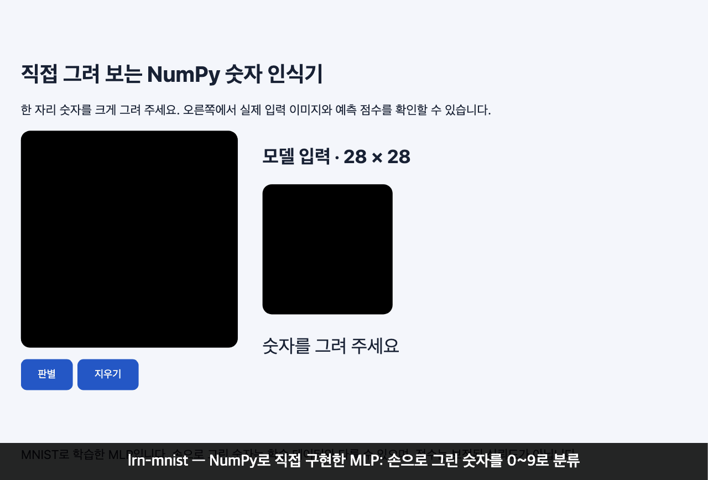
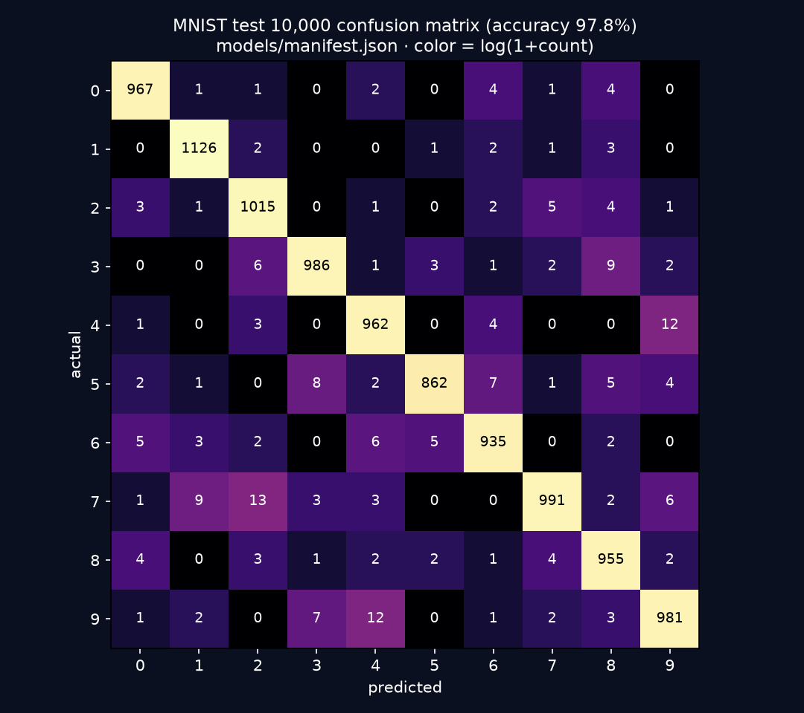

# lrn-mnist

손글씨 숫자 하나를 0~9로 분류하는 **NumPy 신경망**입니다. 프레임워크 없이 MLP·역전파·BatchNorm·Dropout·Adam을 직접 구현하고, 이미지 파일이나 브라우저 캔버스에 그린 숫자를 판별합니다. 포함된 모델의 MNIST 테스트 정확도는 **97.80%**입니다.

> **크래프톤 정글 팀 과제(원본: [Jungle-12-303/wk13_6_mnist](https://github.com/Jungle-12-303/wk13_6_mnist), 비공개)에서 시작했고, 종료 후 개인 저장소에서 계속 수정·학습·확장하고 있다.** 3인 팀, 본인 커밋 12개. 자세한 내용은 [내 기여](#내-기여)·[출처](#출처).

[딥러닝 Wiki](https://docs.woonyong.com/wiki/deep-learning/) · [모델·혼동행렬·학습 조건](models/manifest.json)

## 데모 (구동모습)



`make demo` 후 `make serve` → http://127.0.0.1:8765 에서 캔버스에 7과 3을 마우스로 그리고 판별한 화면입니다. 제공 모델(`models/reference.npz`)의 실제 출력이며 두 경우 모두 해당 숫자가 100.0%로 표시됐습니다. 예시로 고른 두 장이므로 정확도를 뜻하지 않고, 점수는 보정된 confidence가 아닙니다. 모델 정확도는 [manifest](models/manifest.json)를 봅니다.

## 문제와 목표

MNIST는 이미 잘 풀린 문제라서 정확도 숫자 자체보다 **직접 구현한 신경망이 맞게 동작한다는 증거**와 **숫자를 믿을 수 있게 만드는 평가 방식**이 과제의 핵심입니다.

- 목표 1: Affine·ReLU·BatchNorm·Dropout·Softmax+Cross Entropy와 그 backward, SGD·Adam을 NumPy만으로 구현하고, 수치 미분으로 gradient가 맞는지 확인한다.
- 목표 2: 테스트 데이터를 모델 선택에 쓰지 않는 평가(train/validation/test 분리)를 한다.
- 목표 3: 학습한 모델을 저장·복원해 이미지 파일과 손그림 화면으로 실제 입력을 판별한다.
- 비목표: CNN, OCR, 여러 자리 숫자 인식.

## 결과

| 지표 | 값 | 비고 |
|---|---:|---|
| 테스트 정확도 | **97.80%** (9,780 / 10,000) | 모델 선택에 쓰지 않은 공식 test 10,000장 |
| 검증 정확도 | 97.84% | 선택에 쓴 validation 10,000장 |
| 학습 시간 | 5.3초 | 8 epoch, Apple M4, 데이터 다운로드 제외 |
| 모델 파일 | 847,725 바이트 | `models/reference.npz` |
| 오분류 | 220장 | 가장 많은 혼동: 7→2 13회, 4→9 12회, 9→4 12회 |



혼동행렬은 [models/manifest.json](models/manifest.json)의 `evaluation.confusion_matrix` 수치를 그대로 그렸습니다(행 합계 = 테스트 10,000장).

재현: `make setup && make evaluate`(공개 MNIST 약 11 MiB를 내려받음)가 test 정확도 0.978과 모델 sha256(`bcbcbdeb…`)을 [manifest](models/manifest.json)와 같게 출력하는 것을 확인했습니다. 학습 환경은 manifest에 기록돼 있습니다(Python 3.12.12, NumPy 2.5.3, seed 42).

**팀 과제 시점의 수치(98.54%)와 직접 비교하지 마세요.** 팀 보고서의 최종 모델은 은닉층 [512, 256]·Dropout 0.5·학습 데이터 60,000개이고, **테스트 정확도가 가장 높은 설정을 골랐습니다**([REPORT.md@6a7e451](https://github.com/woonyong-choi/lrn-mnist/blob/6a7e451/REPORT.md)). 이 저장소는 모델도 평가 방식도 다르며, 테스트를 선택에 쓰지 않은 97.80%가 정직한 추정치입니다.

## 실행 방법

Python 3.12와 [uv](https://docs.astral.sh/uv/getting-started/installation/)가 필요합니다. 의존성은 `requirements.lock`으로 고정합니다.

```sh
make setup
make demo
make serve
# 브라우저: http://127.0.0.1:8765
```

데모와 손그림 화면은 포함된 모델을 사용하므로 MNIST 다운로드나 재학습이 필요 없습니다. 예측 숫자·클래스별 점수와 실제 모델에 입력된 28×28 이미지를 확인합니다. 서버는 Ctrl-C로 종료합니다.

```sh
make test
.venv/bin/python src/application.py predict examples/digit-7.png
# 새 모델 학습은 별도 실행: 제공 모델을 덮어쓰지 않음
make train
.venv/bin/python src/application.py evaluate --model .artifacts/model.npz --output .artifacts/my-evaluation/metrics.json
```

## 설계

이미지 반전·crop·비율 유지·중심 정렬 → 28×28 입력 → MLP → 클래스별 점수로 이어집니다.

**모델 구성** ([network.py](src/network.py), [layers.py](src/layers.py))

```text
784 → Affine(128) → BatchNorm → ReLU → Dropout(0.1)
    → Affine(64)  → BatchNorm → ReLU → Dropout(0.1)
    → Affine(10)  → Softmax + Cross Entropy
```

- **초기화**: 가중치는 He 초기화(`randn * sqrt(2 / fan_in)`, ReLU에 맞는 분산), bias는 0, BatchNorm의 γ는 1·β는 0입니다.
- **학습 설정**: Adam(lr 0.001), batch 128, 8 epoch, seed 42. MNIST training 60,000개를 seed 42로 **train 50,000 / validation 10,000**으로 나누고, validation 정확도가 가장 높은 epoch의 모델을 씁니다. 공식 test 10,000개는 선택에 쓰지 않습니다.
- **왜 이 설정인가**: 팀 실험에서 은닉층을 [1024, 512]로 키워도 같은 98.54%에 파라미터·시간만 늘었고 [5120]도 비용 대비 이득이 제한적이었으며, Adam은 SGD보다 결과 변화 폭이 작았습니다([보고서](https://github.com/woonyong-choi/lrn-mnist/blob/6a7e451/REPORT.md) §5). 이 저장소는 그 결과를 바탕으로 5초 안에 재학습되는 작은 구성을 기준으로 삼았습니다. Dropout을 0.5에서 0.1로 낮춘 것의 단독 효과는 측정하지 않았습니다.
- 트레이드오프: 작은 MLP는 빠르고 모델이 0.8 MB지만, 손그림처럼 MNIST와 굵기·위치가 다른 입력에 약합니다.

**입출력** ([application.py](src/application.py), [web/index.html](web/index.html))

- 전처리는 배경이 밝으면 색을 반전하고, 숫자 영역을 잘라 긴 변을 20px로 맞춘 뒤 28×28 캔버스 중앙에 붙입니다(MNIST 규약). 빈 입력은 거절하고 전처리 결과를 화면에 보여 줍니다.
- 모델은 weights와 BatchNorm 통계를 NumPy 배열(`.npz`)로 저장하며 **pickle을 쓰지 않습니다.** 복원은 추론용 weights·BN 통계까지이고 optimizer 상태를 포함한 학습 재개는 지원하지 않습니다.
- 손그림 화면은 loopback에서만 실행합니다.

## 내 기여

3인 팀 과제였고, 팀 저장소에서 **본인 커밋은 12개**(2026-05-22 ~ 05-28, 머지 1개 포함)입니다. `git log --author="woonyong" 316ac86^..6a7e451`로 확인할 수 있습니다.

- 환경: Conda 환경 재현 구성과 안내([316ac86](https://github.com/woonyong-choi/lrn-mnist/commit/316ac86), [2ecc5e1](https://github.com/woonyong-choi/lrn-mnist/commit/2ecc5e1)).
- 구현: 계층 연산·손실·optimizer·학습 루프 정리·완성([5dcf5d6](https://github.com/woonyong-choi/lrn-mnist/commit/5dcf5d6), 6개 파일 +180/−43), 출력층 gradient 계산 흐름 정리([0bcfa7b](https://github.com/woonyong-choi/lrn-mnist/commit/0bcfa7b)).
- 실험·보고서: 하이퍼파라미터·optimizer 비교, 과적합·학습률 진단 실험과 발표용 보고서(2e67daf ~ 6a7e451), 학습 문서 정리(5481372).
- 다른 팀원이 작성한 커밋(BatchNorm·optimizer·network 구현 등)은 본인 기여에 포함하지 않았습니다.

## 검증

[](https://github.com/woonyong-choi/lrn-mnist/actions/workflows/ci.yml) <!-- push 후 URL이 활성화된다. -->

- `make test`(pytest 8개, 약 3초): BatchNorm backward와 전체 MLP gradient가 유한 차분과 일치하는지, Dropout 학습·추론 동작, optimizer 두 스텝, 저장 전후 예측 보존, train/validation이 겹치지 않고 test에 의존하지 않는 분리, 빈 입력·색 반전 전처리를 확인합니다.
- CI([ci.yml](.github/workflows/ci.yml)): ubuntu-latest에서 `uv`로 잠금 파일 그대로 설치하고 `make test`를 실행합니다.

## 배운 점·한계

- **선택에 쓴 데이터로 성능을 말하면 낙관적**입니다. 팀 시절에는 테스트 정확도로 설정을 골랐고, 이 저장소에서 validation 분리를 도입했습니다. 대신 정확도는 98.54% → 97.80%로 낮아졌지만 모델 구성도 달라서 이 차이를 분리해 측정하지는 않았습니다.
- 극단 조건 실험에서 은닉층 10개 MLP는 테스트 11.42%(무작위 수준)로 학습에 실패했고, 마지막 정확도만 보지 말고 loss 곡선을 함께 봐야 한다는 것을 배웠습니다([보고서](https://github.com/woonyong-choi/lrn-mnist/blob/6a7e451/REPORT.md) §5).
- 이미지 한 장에 숫자 하나를 입력하는 MLP입니다. 손그림은 굵기·위치 차이로 오분류할 수 있고, 점수는 보정된 confidence가 아닙니다.

## 출처

**크래프톤 정글 팀 과제(원본: [Jungle-12-303/wk13_6_mnist](https://github.com/Jungle-12-303/wk13_6_mnist), 비공개)에서 시작했고, 종료 후 개인 저장소에서 계속 수정·학습·확장하고 있다.**

- 과제 제공: `krafton-jungle/mnist-lab`(팀 저장소는 이 과제의 사본에서 시작).
- 기간: 2026-05-22 ~ 05-28 (팀 저장소 커밋 기준). 기준 revision `6a7e451`(원본 개인 사본 [woonyong-choi/SW_AI-W13-mnist](https://github.com/woonyong-choi/SW_AI-W13-mnist)에서 이어 받음).
- 팀 구성: 3인. 본인 담당은 위 [내 기여](#내-기여)(커밋 12개 기준)입니다.
- 개인 확장: 2026-09-08 ~ 2026-09-22, `git log --author="woonyong" 6a7e451..HEAD`. 팀 시절의 신경망 구현 위에 데이터 분리(train/validation/test), 모델 저장·복원(pickle 없음), 이미지 CLI와 손그림 화면, 수치 검증 테스트, CI를 추가했습니다.
- 과제 설명과 이전 실험은 [정리 전 이력](https://github.com/woonyong-choi/lrn-mnist/tree/1c28de6983671e891faac453e392f68b354bdb53)에 남아 있습니다. 과제 제공물의 저작권 표시는 유지합니다.
