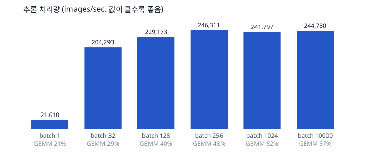

# 벤치마크

`make bench` 가 생성한다. 측정: 2026-09-22 09:34 KST · macOS-26.5.2-arm64-arm-64bit · Python 3.12.12 · NumPy 2.5.3 · BLAS 스레드 1개.

## 1. 재현성 (핵심 주장)

- seed 42 로 다시 학습한 가중치가 `models/reference.npz` 와 **완전히 같다** (비트 단위 비교).
- 검증 정확도 0.9784 가 manifest 기록과 일치한다.

## 2. 학습 시간

- 50,000장 x 8 epoch = **7.3초**
- epoch 별(초): 0.81, 0.85, 0.81, 0.76, 0.85, 0.84, 0.93, 1.10

## 3. 추론 처리량과 병목

| batch | images/sec | 10,000장(초) | 같은 shape 행렬곱만(초) | GEMM 비중 |
|---:|---:|---:|---:|---:|
| 1 | 23,830 | 0.4196 | 0.0778 | 18% |
| 32 | 238,288 | 0.0420 | 0.0152 | 36% |
| 128 | 256,537 | 0.0390 | 0.0114 | 29% |
| 256 | 311,513 | 0.0321 | 0.0104 | 32% |
| 1024 | 325,852 | 0.0307 | 0.0117 | 38% |
| 10000 | 300,533 | 0.0333 | 0.0127 | 38% |

한 장씩 넣으면 초당 23,830장이고 batch 1024 에서 325,852장으로 **14배** 빨라진다. 행렬 크기는 같으므로 차이는 전부 층마다 드는 호출·임시 배열 비용이다.

batch 를 키워도 같은 행렬곱만 돌린 하한이 전체의 38% 에 그친다. 즉 이 모델(784-128-64-10)에서 병목은 행렬곱이 아니라 그 사이의 BatchNorm·ReLU·Softmax 원소 연산과 NumPy 임시 배열 할당이다. 더 줄이려면 층을 더 키우거나(행렬곱 비중을 늘려) 원소 연산을 in-place 로 바꿔야 한다.
